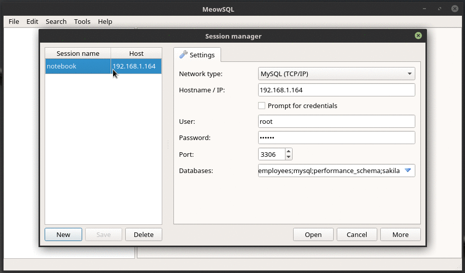

# MeowSQL :scream_cat:

MeowSQL is an attempt to port a very useful GUI database client 
[HeidiSQL](https://www.heidisql.com/) to C++/Qt (with aim to be run natively at least on Linux)

## Download/Install

Download installer for Windows or AppImage([how to run](https://appimage.org/)) 
for Linux on [releases](https://github.com/ragnar-lodbrok/meow-sql/releases) page.

## Features

The app is in development stage at the moment and was never carefully tested, 
though it can be run and do some work (warning: do not use in production!!!).

1. Works on Windows and Linux, in theory can be compiled on any platform with Qt5 and mysql-client support
2. At the moment supports MySQL and PostgreSQL (early stage).
3. Sessions manager: managing multiple connections (warn: no password encryption!) 
4. Connection to multiple sessions (=servers) at once (with multiple databases).
5. Tree of db objects like databases and tables/views/striggers/functions/procedures - (MySQL only).
6. Table: view columns (editable), indexes (editable) and foreign keys (editable) - (MySQL only).
7. Table: view data (basic edit) - (MySQL only).
8. SQL: editor with simple syntax highlighting (no autocomplete).
9. SQL: execute multiple statements at once and see results of SELECT statements 
10. Create and drop tables - (MySQL only)

## Contributing

MeowSQL is a port of [HeidiSQL](https://github.com/HeidiSQL/HeidiSQL), 
so just clone the sources and start rewriting Delphi code to Qt/C++ :

1. Pick up any [issue](https://github.com/ragnar-lodbrok/meow-sql/issues) or any feature from [roadmap](ROADMAP.md).
2. Replace TODOs with working code :smile_cat:
3. Test the app and report bugs
4. Star the repo :star:

Use/subbranch develop, not master branch.

## How to build (for developers)

Note: both QMake and CMake are supported at the moment

Linux:

1. You need gcc (or other compiler) with c++11 support
2. Qt (tested with 5.5-5.9) and QMake (Optionally: Qt Creator) or CMake
3. Clone the repo
4. libmysqlclient library, for deb-based distros: apt-get install libmysqlclient-dev
5. (Optional) Debian: sudo apt-get install mysql-server
6. (Optional) Install test db: https://dev.mysql.com/doc/sakila/en/
7. PostgreSQL client library libpq, for deb-based apt-get install libpq-dev postgresql-server-dev-all
8. As an option use Qt Creator - just open ./meow-sql.pro or ./CMakeLists.txt

Windows:

1. Download and install Qt via online-installer https://www1.qt.io/download-open-source/#section-2
Version that worked for me is Qt 5.6.2 win32-msvc2013
2. You would need a cpp compiler of course, I've got MS Visual Studio 2013 (Community)
3. You should have QMake (plus I used Qt Creator) or CMake
4. I've downloaded MySQL Connector C 6.1 (C not C++), and seems put all necessary files into third_party/
5. I've downloaded PostgreSQL's libpq, and seems put all necessary files into third_party/
6. As an option use Qt Creator - just open ./meow-sql.pro or ./CMakeLists.txt
7. After build (only release worked for me), run windeployqt (or copy all libs from inslalled app)

## License

This project is licensed under the GPL 2.0 License

## Acknowledgments
* HeidiSQL developers - now on [github](https://github.com/HeidiSQL/HeidiSQL)
* [peek](https://github.com/phw/peek) was used for GIF recording
* [linuxdeployqt](https://github.com/probonopd/linuxdeployqt) was used for AppImage creation

